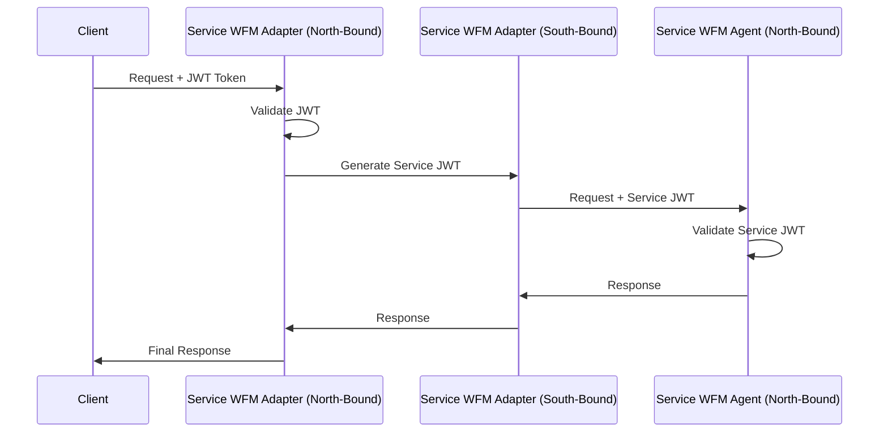

Workload Supplier(Application Developer)
Device Suppliers(End Devices where the apps are deployed)
Workload Fleet Manager(Orchestration Platform, where the Workloads are uploaded, and are provisioned on devices)
Workload 


# Technical Design Document: Service WFM Adapter and Service WFM Agent Architecture

## 1. Executive Summary

This document outlines the technical design for a distributed system comprising two core services: **Service WFM Adapter** (orchestration layer) and **Service WFM Agent** (execution layer). The architecture follows a layered approach with secure bi-directional communication and clear separation of concerns.

## 2. System Overview

### 2.1 High-Level Architecture

```
┌─────────────────────────────────────────────────────────────┐
│                    External Clients                        │
└─────────────────────┬───────────────────────────────────────┘
                      │ HTTPS/JWT
                      ▼
┌─────────────────────────────────────────────────────────────┐
│                   Service WFM Adapter                                 │
│  ┌─────────────────┐              ┌─────────────────────┐   │
│  │  North-Bound    │              │   South-Bound       │   │
│  │   Interface     │              │    Interface        │   │
│  │   (Public API)  │              │  (Internal API)     │   │
│  └─────────────────┘              └─────────────────────┘   │
└─────────────────────────────────────────┬───────────────────┘
                                          │ HTTPS/JWT
                                          ▼
┌─────────────────────────────────────────────────────────────┐
│                   Service WFM Agent                                 │
│  ┌─────────────────┐                                        │
│  │  North-Bound    │                                        │
│  │   Interface     │                                        │
│  │ (Internal API)  │                                        │
│  └─────────────────┘                                        │
│                     │                                       │
│                     ▼                                       │
│  ┌─────────────────────────────────────────────────────┐   │
│  │           Infrastructure Adapters                   │   │
│  │  ┌─────────────┐ ┌─────────────┐ ┌─────────────────┐ │   │
│  │  │ Kubernetes  │ │   Docker    │ │   Environment   │ │   │
│  │  │   Client    │ │   Client    │ │    Managers     │ │   │
│  │  └─────────────┘ └─────────────┘ └─────────────────┘ │   │
│  └─────────────────────────────────────────────────────┘   │
└─────────────────────────────────────────────────────────────┘
```

## 3. Service Specifications

### 3.1 Service WFM Adapter (Orchestration Layer)

**Purpose**: Acts as the primary orchestration and coordination service, managing workflows and delegating execution tasks to Service WFM Agent.

#### 3.1.1 North-Bound Interface (Public API)
- **Protocol**: HTTPS/REST
- **Authentication**: JWT-based authentication
- **Audience**: External clients, web applications, CLI tools
- **Responsibilities**:
  - Accept user requests and workflows
  - Validate input parameters
  - Orchestrate complex operations
  - Return status and results to clients

#### 3.1.2 South-Bound Interface (Internal API)
- **Protocol**: HTTPS/REST or gRPC
- **Authentication**: JWT-based service-to-service authentication
- **Audience**: Service WFM Agent (internal communication)
- **Responsibilities**:
  - Delegate execution tasks to Service WFM Agent
  - Monitor task progress
  - Handle task lifecycle management

### 3.2 Service WFM Agent (Execution Layer)

**Purpose**: Handles direct interaction with infrastructure components and executes tasks delegated by Service WFM Adapter.

#### 3.2.1 North-Bound Interface (Internal API)
- **Protocol**: HTTPS/REST or gRPC
- **Authentication**: JWT-based service-to-service authentication
- **Audience**: Service WFM Adapter
- **Responsibilities**:
  - Receive execution requests from Service WFM Adapter
  - Report task status and progress
  - Handle infrastructure-specific operations

#### 3.2.2 Infrastructure Integrations
- **Kubernetes API**: Pod, Service, Deployment management
- **Docker API**: Container lifecycle management
- **Environment Managers**: Various deployment environments (dev, staging, prod)

## 4. Communication Patterns

### 4.1 Request Flow

```
Client Request → Service WFM Adapter (North-Bound) → Service WFM Adapter (Internal Logic) 
                                        ↓
Service WFM Agent (Infrastructure) ← Service WFM Agent (North-Bound) ← Service WFM Adapter (South-Bound)
```

### 4.2 Authentication Flow



## 5. Technical Implementation

### 5.1 Technology Stack

- **Language**: Go 1.21+
- **Web Framework**: Gin or Echo for REST APIs
- **gRPC**: For high-performance internal communication (optional)
- **Authentication**: JWT with RS256 signing
- **Database**: PostgreSQL for persistent state
- **Message Queue**: Redis or RabbitMQ for async operations
- **Monitoring**: Prometheus + Grafana
- **Logging**: Structured logging with Zap

### 5.2 Service WFM Adapter Implementation Structure

```
service-x/
├── cmd/
│   └── server/
│       └── main.go
├── internal/
│   ├── api/
│   │   ├── northbound/     # Public API handlers
│   │   └── southbound/     # Internal API client
│   ├── auth/
│   │   ├── jwt.go
│   │   └── middleware.go
│   ├── orchestrator/       # Core business logic
│   └── config/
├── pkg/
│   ├── client/            # Service WFM Agent client
│   └── models/            # Shared data models
└── api/
    ├── openapi/           # API specifications
    └── proto/             # gRPC definitions (if used)
```

### 5.3 Service WFM Agent Implementation Structure

```
service-WFM Agent/
├── cmd/
│   └── server/
│       └── main.go
├── internal/
│   ├── api/
│   │   └── northbound/     # Internal API handlers
│   ├── auth/
│   │   ├── jwt.go
│   │   └── middleware.go
│   ├── adapters/
│   │   ├── kubernetes/     # K8s integration
│   │   ├── docker/         # Docker integration
│   │   └── environment/    # Environment management
│   ├── executor/           # Task execution logic
│   └── config/
├── pkg/
│   ├── k8s/               # Kubernetes utilities
│   ├── docker/            # Docker utilities
│   └── models/            # Shared data models
```

## 6. API Specifications

### 6.1 Service WFM Adapter North-Bound API

```yaml
# Example endpoints
POST /api/v1/workflows
GET  /api/v1/workflows/{id}
POST /api/v1/workflows/{id}/execute
GET  /api/v1/workflows/{id}/status
DELETE /api/v1/workflows/{id}
```

### 6.2 Service WFM Adapter South-Bound API (Client for Service WFM Agent)

```yaml
# Internal communication endpoints
POST /internal/v1/tasks
GET  /internal/v1/tasks/{id}
POST /internal/v1/tasks/{id}/cancel
GET  /internal/v1/health
```

### 6.3 Service WFM Agent North-Bound API

```yaml
# Endpoints consumed by Service WFM Adapter
POST /api/v1/tasks
GET  /api/v1/tasks/{id}
PUT  /api/v1/tasks/{id}/status
DELETE /api/v1/tasks/{id}
GET  /api/v1/health
POST /api/v1/environments/{env}/deploy
GET  /api/v1/environments/{env}/status
```

## 7. Security Considerations

### 7.1 Authentication & Authorization

- **JWT Tokens**: RS256 algorithm with key rotation
- **Token Expiration**: Short-lived tokens (15-30 minutes)
- **Refresh Mechanism**: Separate refresh tokens for clients
- **Service-to-Service**: Mutual TLS + JWT for internal communication

### 7.2 Network Security

- **TLS 1.3**: All communication encrypted
- **Network Policies**: Kubernetes network policies for pod-to-pod communication
- **Firewall Rules**: Restrict access to internal APIs
- **Rate Limiting**: Implement rate limiting on all endpoints

## 8. Deployment Architecture

### 8.1 Kubernetes Deployment

```yaml
# Service WFM Adapter Deployment
apiVersion: apps/v1
kind: Deployment
metadata:
  name: service-x
spec:
  replicas: 3
  selector:
    matchLabels:
      app: service-x
  template:
    spec:
      containers:
      - name: service-x
        image: service-x: